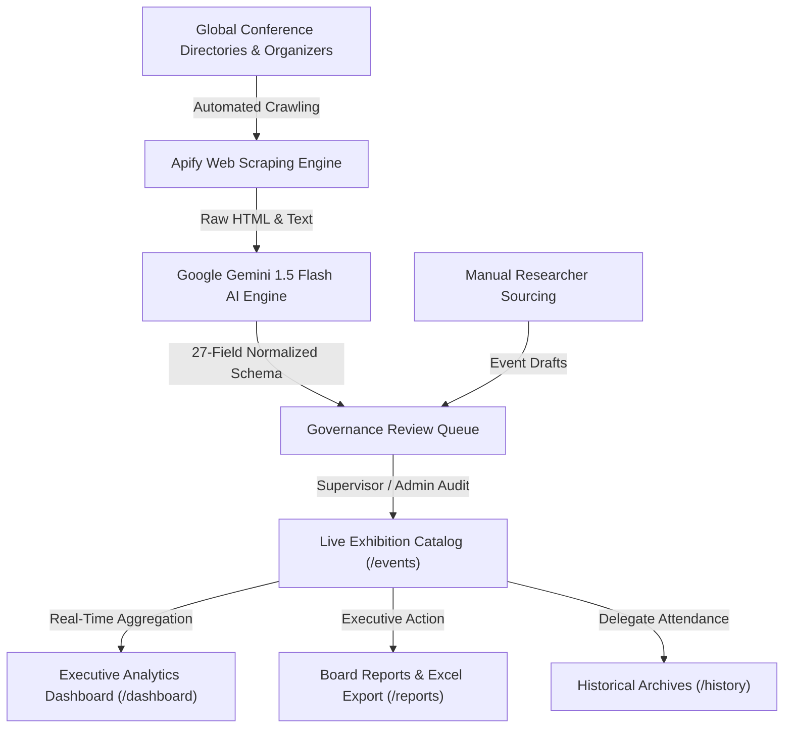
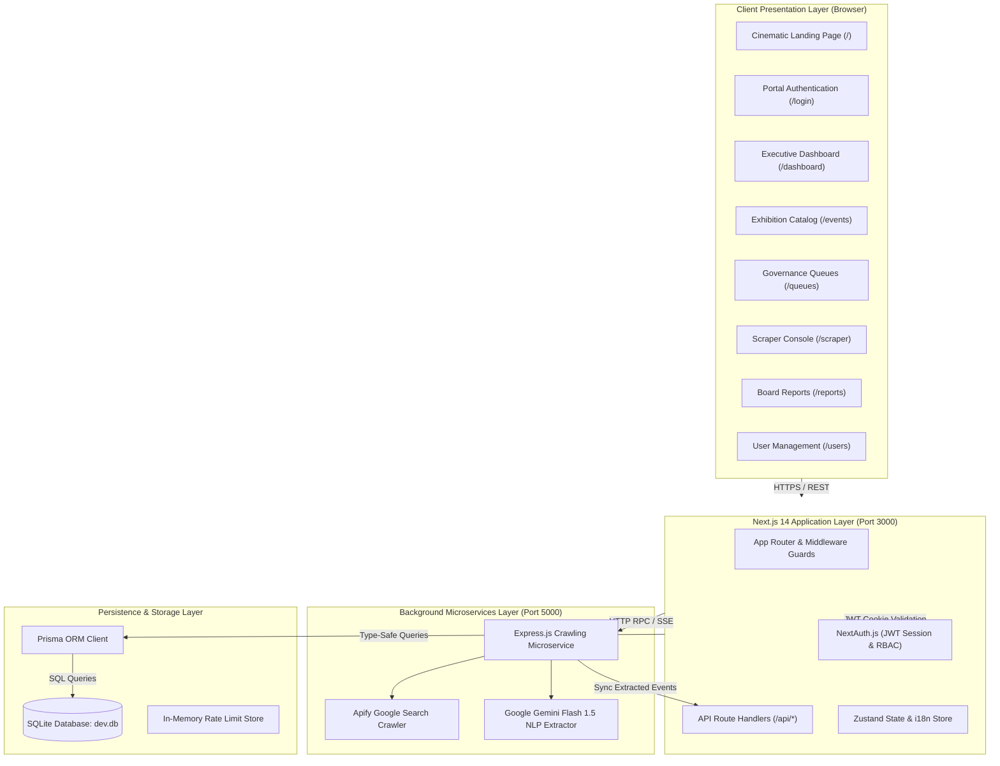

# ❖ LIFEVENT — System Overview Specification

> **Platform:** LIFEVENT (Lifewood Tech Exhibition Intelligence Platform)  
> **Target Audience:** Executive Leadership, Business Development, Data Operation Teams  
> **Document Version:** 1.0.0  
> **Organization:** Lifewood Data Technology  

---

## 1. Executive Summary & Vision

**LIFEVENT** is an enterprise-grade business intelligence and exhibition management system built specifically for **Lifewood Data Technology**. The platform automates the discovery, classification, multi-dimensional audit, strategic scoring, and lifecycle governance of global technology exhibitions, industrial conventions, and AI summits.

By tracking over **500+ global events** across 38+ countries, LIFEVENT transforms raw, fragmented conference data into board-level strategic intelligence. It bridges the gap between internet-wide event announcements and measurable business development (BD) ROI by mapping every conference opportunity against Lifewood’s core data service capabilities.

---

## 2. Strategic Context: Lifewood's 6 Core Service Lines

Every exhibition entered into LIFEVENT is scored and evaluated against Lifewood's six strategic business capabilities:

| # | Service Line | Strategic Focus | Target Exhibition Profiles |
| :--- | :--- | :--- | :--- |
| **1** | **Global AI Data** | Multilingual text/audio annotation, human-in-the-loop (HITL) evaluation, RLHF training datasets. | Enterprise AI summits, LLM developer forums, natural language processing conventions. |
| **2** | **AIGC & Generative AI** | Model safety red-teaming, prompt engineering datasets, synthetic media evaluation. | GenAI world congresses, AI safety & ethics summits, creative tech expos. |
| **3** | **Autonomous Driving** | 3D point-cloud LiDAR labeling, radar annotation, multi-sensor spatial vision pipelines. | Automotive OEM conventions, ADAS summits, sensor & mobility expos. |
| **4** | **AEO & GEO** | Answer-Engine Optimization, Generative Engine Optimization, LLM citation monitoring. | Digital marketing conferences, AI search marketing summits, SEO world forums. |
| **5** | **EDGE Intelligence** | Ultra-low latency on-device vision, IoT telemetry, lightweight embedded model inference. | Embedded World, industrial robotics expos, smart camera & IoT conventions. |
| **6** | **Global Scanning & Indexing** | High-volume optical character recognition (OCR), multi-format document scanning, metadata archiving. | Library & archive digitization summits, enterprise records management expos. |

---

## 3. High-Level System Architecture

LIFEVENT is constructed as a modern, decoupled web architecture comprising a Next.js 14 full-stack core and a dedicated background crawling microservice.

---

## 4. Key Subsystems & Core Capabilities

### 4.1. Cinematic Landing Experience (`/`)
* **Dual-Theme Design System**: Clean White canvas (`#FFFFFF`) with frosted **Sea Salt** (`#F9F7F7`) navigation in Light Mode; true OLED **Black** (`#000000`) with elevated Zinc-950 cards in Dark Mode.
* **Interactive 3D Tilt Hero**: Mouse-reactive command center frame providing live previews of executive KPIs, crawler signals, and fit score breakdowns.
* **Global Summit Marquee Ticker**: Continuous ticker displaying premier worldwide tech exhibitions (CES, MWC, AutoSens, InnoEX) with interactive click-to-inspect dossiers.
* **Interactive Bento Grid & Business Lines Matrix**: Six-service capability filter highlighting matched event counts, average fit scores, and target conferences.

### 4.2. Executive Intelligence Dashboard (`/dashboard`)
* **KPI Metrics**: Real-time counters for Total Exhibitions, Forward Pipeline Opportunities, Global Average Fit Score, and Continent/Regional Coverage.
* **Monthly Distribution Chart**: Interactive bar chart displaying upcoming event density by month with time-frame selectors (All Time, 2026, 2027) and high-contrast tooltips.
* **Strategic Fit Score Breakdown**: Radial and bar distributions of events rated from 1.0 to 5.0.
* **Coverage Gap Assessment**: Automated algorithmic alert surfacing months with fewer than 5 high-fit opportunities.
* **Business Line Coverage Radar**: Quantitative breakdown of how well the calendar covers each of Lifewood's 6 offerings.

### 4.3. Exhibition Catalog & Specification (`/events`)
* **Dual-View Modes**: Switch effortlessly between visual responsive Event Cards and a high-density tabular view.
* **Multi-Vector Filtering**: Filter instantly by keyword, geographic region, primary service line, minimum fit score, and ticketing status (Free vs Paid).
* **27-Column Event Dossier (`/events/[id]`)**: Deep-dive record view detailing event identity, venue, Google Maps link, booth pricing tiers, registration deadlines, and Lifewood strategic relevance.
* **Delegate Attendance Tracking**: "Mark as Attended" action that transitions events into the permanent historical archive.

### 4.4. Governance & Review Queues (`/queues`)
* **Double-Blind Verification**: Any record created by AI scraping or drafted by junior researchers enters `PENDING_REVIEW`.
* **Full-Field Specification Inspection**: Reviewers can inspect all technical parameters, verify official sources, and approve or reject submissions with logged rationales.

### 4.5. AI Scraper Control Engine (`/scraper`)
* **Crawler Dispatcher**: One-click execution targeting convention center portals, global tech indexes, and organizer databases.
* **AI Extraction Pipeline**: Leverages Google Gemini Flash 1.5 to parse unstructured conference HTML into the standardized 27-field schema.
* **Staging Area**: Review and approve newly scraped events before passing them to the primary governance queue.

### 4.6. Executive Report Generator (`/reports`)
* **Custom Scopes**: Filter reports by continent/region, primary business line, or full database calendar.
* **Board-Ready Formats**: Export branded HTML executive briefings with embedded styling or raw Excel (`.xlsx`) datasets for offline modeling.

---

## 5. Security & Access Governance

* **Role-Based Access Control (RBAC)**:
  * **`SUPERADMIN`**: Unrestricted authority (user account administration, system configs, all CRUD).
  * **`ADMIN`**: Full event auditing, queue approval/rejection, report generation, scraper controls.
  * **`USER` (Intern)**: Draft creation, catalog exploration, public analytics viewing.
* **Authentication**: Encrypted NextAuth JWT sessions with 24-hour expiration.
* **Rate Limiting Guard**: Built-in 5-attempt threshold per email address with automated 60-second cooldown windows to prevent brute-force attacks.
* **Password Encryption**: All credentials stored with 10-round salted `bcrypt` hashing.

---

## 6. Document Navigation

* For step-by-step operational pipelines, consult [SYSTEM_WORKFLOW.md](file:///SYSTEM_WORKFLOW.md).
* For end-user instructions on exploring the dashboard, consult [USER_MANUAL_DASHBOARD_VIEWER.md](file:///USER_MANUAL_DASHBOARD_VIEWER.md).
* For developer deployment, maintenance, and database setup, consult [HANDOVER_GUIDE.md](file:///HANDOVER_GUIDE.md).
* For comprehensive dependency and package architecture, consult [TECH_STACK.md](file:///TECH_STACK.md).
