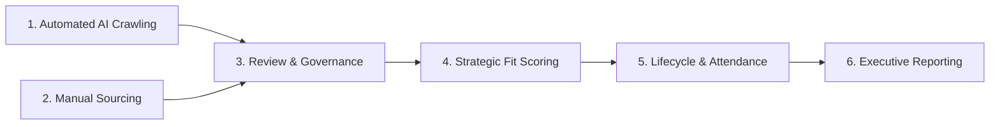
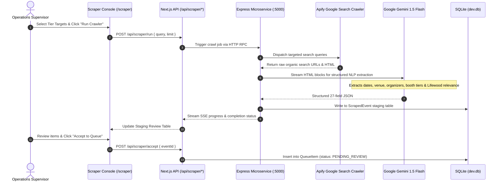
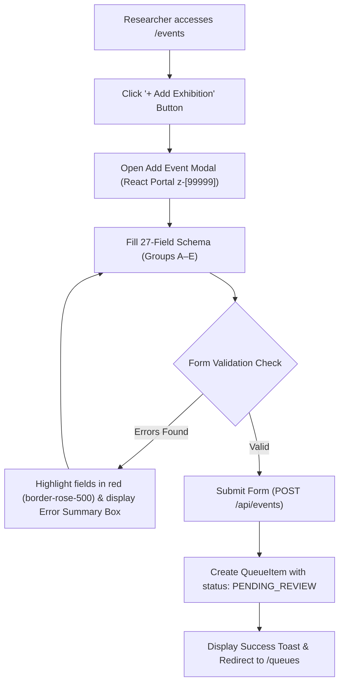
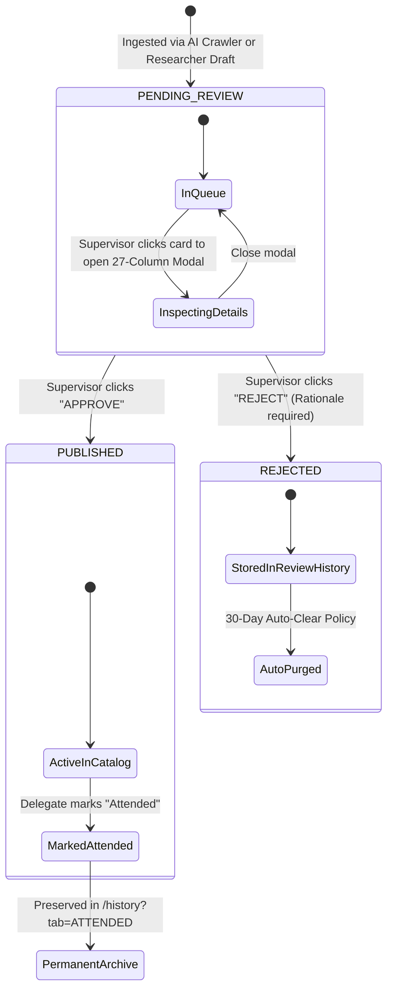
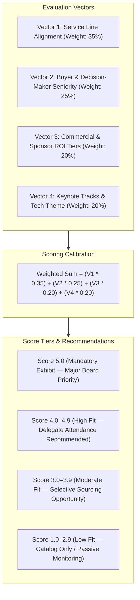
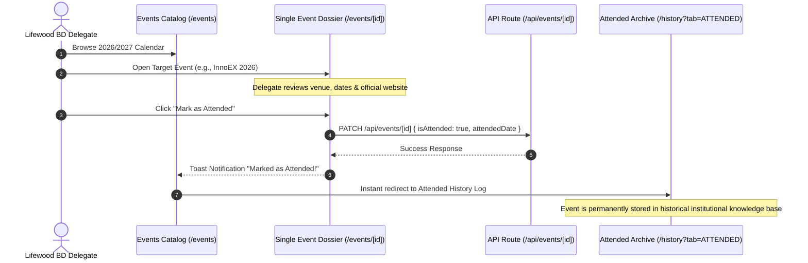
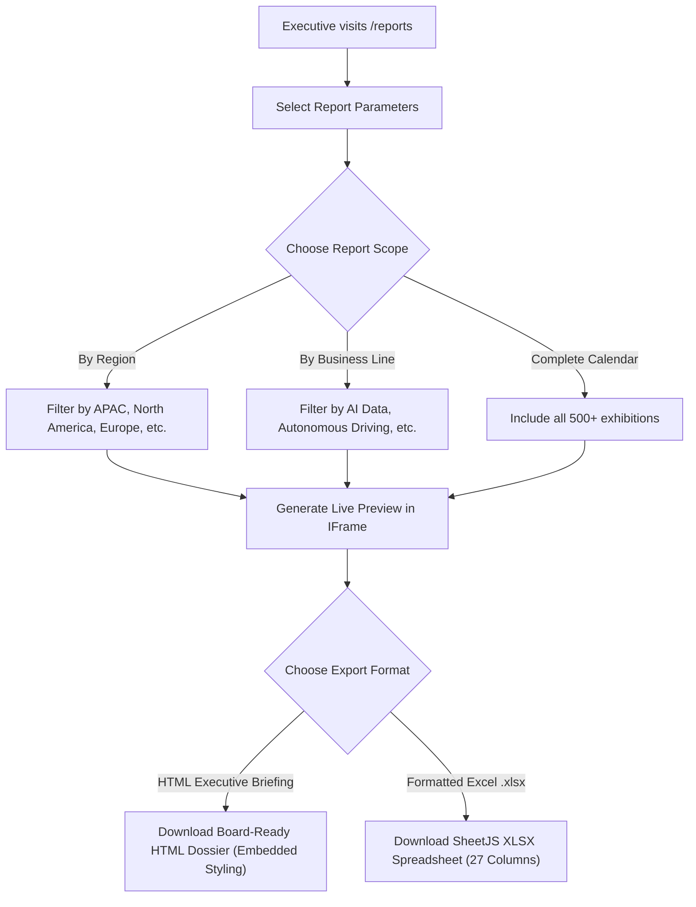

# ❖ LIFEVENT — System Workflow & Operational Pipelines

> **Platform:** LIFEVENT (Lifewood Tech Exhibition Intelligence Platform)  
> **Target Audience:** Engineering, Product, Operations, and Business Development Teams  
> **Document Version:** 1.0.0  
> **Organization:** Lifewood Data Technology  

---

## 1. Overview of Platform Workflows

The LIFEVENT architecture orchestrates six core operational workflows that manage the journey of an exhibition from raw internet signal to verified executive decision:

---

## 2. Pipeline 1: Automated AI Discovery & Web Crawling

The automated crawler identifies new tech conferences across global convention centers, official organizer listings, and industry calendars.

### Crawling Rules & Deduplication Logic
1. **URL Fingerprinting**: Event URLs are normalized (stripping tracking query parameters like `utm_*`, `ref`, `fbclid`).
2. **Name & Year Fuzzy Matching**: If an event with the same normalized name and calendar year exists in the catalog, it is flagged with a `DUPLICATE_SUSPECT` warning badge.
3. **Staging Review Isolation**: Raw scraper output never touches the active exhibition catalog directly. Every scraped entry must be accepted into the review queue.

---

## 3. Pipeline 2: Manual Event Sourcing & Queue Submission

When human researchers or BD representatives identify proprietary or invite-only exhibitions, they input records manually.

### Required Field Groups
* **Group A — Identity**: Event Name, Region, Country, City, Category.
* **Group B — Timing**: Human Dates (e.g. `Apr 6–9, 2026`), Start Date (`YYYY-MM-DD`), End Date (`YYYY-MM-DD`).
* **Group C — Venue & Coordinates**: Venue Name, Full Street Address (enables Google Maps link), Official Website.
* **Group D — Strategic Alignment**: Business Lines (multiple selection), Strategic Focus, Relevance to Lifewood, Fit Score (1–5), Priority Level.
* **Group E — Commercials**: Estimated Attendees, Booth Pricing, Registration Deadline, Contact Email/Person.

---

## 4. Pipeline 3: Multi-Tier Review & Governance Workflow

Every exhibition must pass through supervisor verification before appearing on executive dashboards.

### Governance Controls
1. **One-Click Audit Modal**: Clicking any Queue Card launches a full specification modal detailing all commercial, geographic, and relevance fields.
2. **Audit Provenance**: Every approval or rejection permanently records the `reviewerId`, timestamp, and rejection rationale.
3. **30-Day Retention**: Approved and rejected review history items are archived for 30 days before automatic cleanup to keep queues performant.

---

## 5. Pipeline 4: Strategic Fit Scoring Algorithm

The Strategic Fit Score (1.0 to 5.0) quantifies how well an exhibition justifies commercial sponsorship and delegate travel.

### Fit Score Tiers Breakdown

| Fit Score | Tier Level | Action Recommendation | Typical Characteristics |
| :---: | :--- | :--- | :--- |
| **`5.0`** | **Tier 1: Strategic Must-Attend** | **Exhibit & Sponsor** | High alignment with ≥ 3 core service lines, C-level attendees (> 10,000+), dedicated AI/Autonomous tracks. |
| **`4.0 – 4.9`** | **Tier 2: High Value** | **Send Delegate** | Strong alignment with 1–2 service lines, high enterprise buyer ratio, direct lead-generation opportunities. |
| **`3.0 – 3.9`** | **Tier 3: Niche / Targeted** | **Monitor / Virtual** | Regional convention or adjacent industry expo (e.g. lighting, general electronics) with isolated AI tracks. |
| **`1.0 – 2.9`** | **Tier 4: Low Alignment** | **Ignore / Archive** | General consumer expo or academic symposium with negligible commercial buyer interest for data labeling. |

---

## 6. Pipeline 5: Event Lifecycle & Attendance Archiving

Once published, exhibitions enter the active tracking lifecycle.

---

## 7. Pipeline 6: Executive Reporting & Export Workflow

Leadership requires board-ready documentation for conference travel approvals and marketing budget allocations.

### Export Formats
* **HTML Executive Briefing**: Formatted with Lifewood brand aesthetics, including executive summary KPIs, high-fit radar breakdowns, monthly bar charts, and print-ready CSS pagination.
* **Formatted Excel Spreadsheet (`.xlsx`)**: Structured data tables containing all 27 technical parameters, formatted headers, and column width auto-fits for offline financial modeling.
