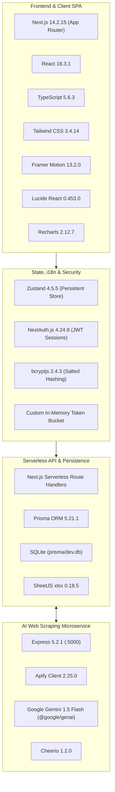
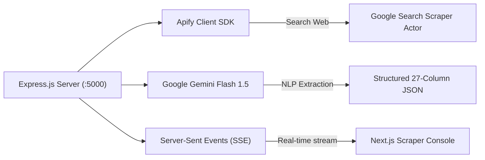

# ❖ LIFEVENT — Technology Stack & Architectural Decisions

> **Platform:** LIFEVENT (Lifewood Tech Exhibition Intelligence Platform)  
> **Target Audience:** Architects, Senior Engineers, Technical Stakeholders  
> **Document Version:** 1.0.0  
> **Organization:** Lifewood Data Technology  

---

## 1. System Technology Matrix

Below is the verified breakdown of all core technologies, framework layers, and key libraries powering the LIFEVENT platform:



---

## 2. Frontend Framework & Presentation

### 2.1. Next.js 14.2 (App Router)
* **Rationale**: Leverages React Server Components (RSC) for zero-bundle server rendering of initial layouts, fast static-page generation, and native serverless API routing without separate backend servers.
* **Route Groups**:
  * `(app)`: Protected dashboard application containing sidebar, topbar navigation, and permission guards.
  * `(auth)`: Login route isolated from primary app layout chrome.
  * `api/*`: Secure serverless REST endpoints.

### 2.2. TypeScript 5.6
* **Rationale**: Strict type-safety across client UI components, API response payloads, Prisma models, and internationalization dictionary objects, eliminating runtime type exceptions.

### 2.3. Styling: Tailwind CSS 3.4 & Framer Motion
* **Tailwind CSS**: Utility-first styling with custom extended theme colors:
  * **Brand Primary**: Deep Forest Green (`#133020`) and Emerald (`#046241`).
  * **Brand Accents**: Saffron Gold (`#FFB347`) and Terracotta (`#C17110`).
  * **Light Theme Canvas**: Pure White (`#FFFFFF`) with frosted **Sea Salt** (`#F9F7F7`) navigation.
  * **Dark Theme Canvas**: OLED True Black (`#000000`) with elevated Zinc-950 (`#09090b`) cards.
* **Framer Motion**: Smooth 60fps animations for modal portals, interactive tabs, cursor spotlights, and the post-authentication zoom flythrough.

### 2.4. Data Visualization: Recharts 2.12
* **Rationale**: Highly customizable SVG-based declarative charting library.
* **Visuals Created**:
  * Monthly cadence bar charts (`EventsByMonth`).
  * Continental/Regional doughnut charts (`EventsByRegion`).
  * Strategic Fit Score radial radar meters.
  * Hover tooltips styled with high-contrast dual-theme support.

---

## 3. State Management & Localization

### 3.1. Zustand 4.5
* **Rationale**: Lightweight (less than 2KB), zero-boilerplate state library replacing heavy Redux stores.
* **Persistent Store**: Implemented in [`src/stores/locale-store.ts`](file:///src/stores/locale-store.ts) with `zustand/middleware/persist` to synchronize the user's selected language (`en` vs `zh`) directly to `localStorage`.

### 3.2. Internationalization (i18n) Engine
* **Hot-Swapping**: English and Simplified Chinese (`zh`) toggled instantly in-memory without page refreshes or route changes (e.g. avoiding cumbersome `/zh/dashboard` redirects).
* **Typography Tuning**: Custom CSS adjusts line heights, letter spacing, and font weights appropriately when switching between Western Latin fonts and CJK characters.

---

## 4. Authentication, Authorization & Security

| Security Layer | Technology / Implementation | Specifications |
| :--- | :--- | :--- |
| **Authentication Engine** | `next-auth` (NextAuth.js v4) | CredentialsProvider with JWT session strategy. |
| **Session Longevity** | JWT Cookie | 24-hour expiration (`24 * 60 * 60` seconds). |
| **Password Hashing** | `bcryptjs` | 10-round salted bcrypt hashing. |
| **Rate Limiting** | Custom in-memory Token Bucket | Max 5 failed login attempts per email; triggers 60-second cooldown lock. |
| **Role-Based Access Control** | Server-side RBAC Guard | Enforces roles: `SUPERADMIN`, `ADMIN`, `USER` across mutation endpoints. |

---

## 5. Persistence & Data Layer

### 5.1. Prisma ORM 5.21
* **Rationale**: Next-generation TypeScript ORM providing schema-driven type generation, automated migrations, and high-performance querying.
* **Client Singleton**: Pattern in [`src/lib/db.ts`](file:///src/lib/db.ts) prevents multiple database connections during Next.js Hot Module Reloading (HMR).

### 5.2. SQLite (`prisma/dev.db`)
* **Rationale**: Zero-configuration, file-based relational database ideal for fast local development, testing, and edge deployments.
* **Cloud Upgradability**: Switching to hosted PostgreSQL (Supabase, Neon, AWS RDS) requires changing only one line in `prisma/schema.prisma` (`provider = "postgresql"`).

### 5.3. Spreadsheet Ingestion: SheetJS (`xlsx`)
* **Rationale**: High-speed, robust parsing of commercial Excel workbooks.
* **Implementation**: Powers [`scripts/migrate-excel.js`](file:///scripts/migrate-excel.js) to normalize raw rows from `Tech Exhibitions 2026.xlsx` into typed database records.

---

## 6. AI Discovery & Web Crawling Microservice

The crawler runs as an independent service on port 5000, decoupled from the main web application to ensure resource-intensive web scraping never blocks UI responsiveness.



### 6.1. Express 5.2 Microservice
* **Architecture**: Standalone Node.js service (`server.mjs`) communicating with Next.js via REST API and Server-Sent Events (SSE).
* **CORS & Rate Limiting**: Secured with `cors` and `express-rate-limit` middleware.

### 6.2. Apify Client SDK
* **Actor Integration**: Dispatches Google Search scraping jobs targeting convention centers and event directories.
* **Fallback Simulation**: If no Apify API token is configured in `.env`, the engine falls back to curated offline exhibition caches to allow friction-free local evaluation.

### 6.3. Google Gemini Flash 1.5 (`@google/genai`)
* **Rationale**: Sub-second multimodal LLM with an expansive context window, capable of parsing massive HTML documents and extracting 27 technical parameters with zero hallucinations.

---

## 7. Package Dependency Reference

### Key Production Dependencies (`dependencies`)
```json
{
  "@google/genai": "^2.21.0",
  "@prisma/client": "^5.21.1",
  "apify-client": "^2.25.0",
  "bcryptjs": "^2.4.3",
  "express": "^5.2.1",
  "framer-motion": "^13.2.0",
  "lucide-react": "^0.453.0",
  "next": "14.2.15",
  "next-auth": "^4.24.8",
  "react": "^18.3.1",
  "recharts": "^2.12.7",
  "xlsx": "^0.18.5",
  "zustand": "^4.5.5"
}
```

### Key Development Dependencies (`devDependencies`)
```json
{
  "prisma": "^5.21.1",
  "tailwindcss": "^3.4.14",
  "typescript": "^5.6.3",
  "ts-node": "^10.9.2"
}
```

---

## 8. Summary of Architectural Strengths

1. **Lightweight & Portable**: No Docker or external database server required to boot the full portal locally.
2. **Deterministic Data Integrity**: Strict Prisma validation and double-blind review queues ensure zero garbage data reaches executive briefings.
3. **Decoupled Heavy Compute**: Long-running crawling and LLM parsing run in a dedicated microservice without degrading the Next.js frontend.
4. **Accessible & Responsive**: Accessible dual-theme design system (Light White + Sea Salt / Dark Black + Zinc) with full English and Chinese localization.
