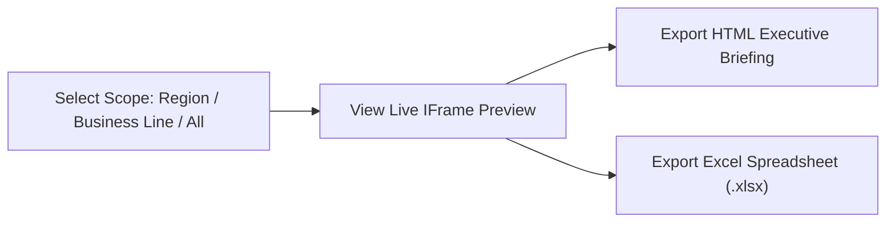

# ❖ LIFEVENT — User Manual: Dashboard & Viewer Guide

> **Platform:** LIFEVENT (Lifewood Tech Exhibition Intelligence Platform)  
> **Target Audience:** Business Development Representatives, Market Analysts, Executive Viewers, and Global Conference Delegates  
> **Document Version:** 1.0.0  
> **Organization:** Lifewood Data Technology  

---

## 1. Getting Started & Portal Access

### 1.1. Accessing the Application
1. Open your web browser and navigate to the application URL:  
   **`http://localhost:3000`** (or your production deployment domain).
2. Click the **"Sign In"** button on the top-right of the landing page, or go directly to [**`/login`**](http://localhost:3000/login).

### 1.2. Default Credentials
Use the credentials assigned to your role:

| Access Role | Email | Password | Intended User Group |
| :--- | :--- | :--- | :--- |
| **`SUPERADMIN`** | `admin@lifewood.com` | `admin123` | Executive Management, IT Administrators |
| **`ADMIN`** | `supervisor@lifewood.com` | `supervisor123` | BD Directors, Operations Leads |
| **`USER`** | `intern@lifewood.com` | `intern123` | Researchers, Field Delegates, Analysts |

> [!TIP]
> After logging in, an animated LIFEVENT emblem will display a ~1-second flythrough transition, redirecting you smoothly into the **Executive Dashboard**.

---

## 2. Personalizing Your Workspace

### 2.1. Dual Theme Switching (Light & Dark Modes)
LIFEVENT features two purpose-built display themes designed for comfortable viewing in any lighting environment:
* **☀️ Light Mode**: A clean, modern White canvas (`#FFFFFF`) with frosted **Sea Salt** (`#F9F7F7`) navigation.
* **🌙 Dark Mode**: A true OLED **Black** (`#000000`) background with elevated Zinc-950 panels, minimizing eye fatigue during late-night analysis.

**How to Toggle:**  
Click the **Sun / Moon** icon located on the top-right of the navigation bar or application topbar. Your preference is automatically saved in your browser.

### 2.2. Instant Bilingual Hot-Swapping (English & 中文)
LIFEVENT provides full bilingual localization:
* Click the **Globe** icon (`EN` / `中文`) on the topbar or landing page header.
* Select either **English** or **简体中文**. All headings, metrics, tables, and tooltips will instantly update without reloading the page.

---

## 3. Navigating the Executive Dashboard (`/dashboard`)

The **Executive Dashboard** is your primary analytical command center. It provides high-level intelligence on forward conference opportunities.

```
┌────────────────────────────────────────────────────────────────────────┐
│  TOTAL EXHIBITIONS     FORWARD PIPELINE     AVG FIT SCORE    REGIONS   │
│       520+                   184               4.8 / 5         4 Cont. │
├──────────────────────────────────────┬─────────────────────────────────┤
│                                      │                                 │
│    EXHIBITIONS BY MONTH (BAR CHART)  │   EVENTS BY REGION (DONUT)      │
│    [Period: 2026 | 2027 | All Time]  │   APAC • NA • EMEA • LATAM      │
│                                      │                                 │
├──────────────────────────────────────┴─────────────────────────────────┤
│    BUSINESS LINE COVERAGE            │   COVERAGE GAP ASSESSMENT       │
│    Global AI Data (38%)              │   ⚠️ July 2026: Low Pipeline    │
│    Autonomous Driving (24%)          │   ⚠️ Oct 2026: Needs Sourcing   │
└────────────────────────────────────────────────────────────────────────┘
```

### 3.1. Key Performance Indicator (KPI) Metric Cards
Located at the top of the dashboard, these cards show instant aggregates:
* **Total Exhibitions**: Cumulative count of verified conferences in the database.
* **Forward Pipeline**: Exhibitions scheduled within the next 12 to 24 months.
* **Average Fit Score**: Mean strategic alignment rating (out of 5.0) across all forward events.
* **Regional Footprint**: Number of global continents actively tracked.

### 3.2. Monthly Distribution Chart
* Shows the volume of tech exhibitions scheduled each calendar month.
* **Timeframe Filters**: Use the dropdown above the chart to toggle between **All Time**, **2026**, and **2027**.
* **Interactive Tooltips**: Hover your mouse over any bar to see the exact count of exhibitions and top business lines for that month.

### 3.3. Events by Region Donut Chart
* Visualizes the geographic distribution of conferences across **APAC (Asia-Pacific)**, **North America**, **Europe (EMEA)**, and **Other**.
* Hover over chart slices to view percentage splits and raw event totals.

### 3.4. Business Line Alignment Breakdown
* Displays how conferences map against Lifewood’s six offerings:
  1. *Global AI Data (Annotation & RLHF)*
  2. *AIGC & Model Safety*
  3. *Autonomous Driving (LiDAR/Radar Vision)*
  4. *AEO / GEO Search Marketing*
  5. *EDGE Intelligence & IoT*
  6. *High-Volume Scanning & Indexing*

### 3.5. Coverage Gap Assessment
* An automated intelligence algorithm flags months that have fewer than 5 high-fit exhibitions.
* Alerts BD teams where proactive web crawling or researcher sourcing is required.

### 3.6. Recently Added Exhibitions
* Displays the five most recently approved records.
* Each card highlights the **Event Name**, **Dates**, **Location**, and a prominent **Fit Score Badge** (e.g. `Score 5.0 / 5.0`).
* Click any card to navigate directly to its full event dossier.

---

## 4. Browsing the Exhibition Catalog (`/events`)

The **Events Catalog** gives you comprehensive search, filtering, and audit capabilities across all 500+ exhibitions.

### 4.1. Card View vs. Table View Switcher
On the top-right of the catalog page, use the view toggle:
* **Grid Card View**: Best for visual scanning; displays event banners, prominent fit score badges, business line pills, and quick metadata.
* **Table View**: High-density tabular layout displaying all primary fields, ideal for rapid scanning, sorting, and comparison.

### 4.2. Multi-Vector Filter Controls
Use the filter bar to narrow down events:
* **Keyword Search**: Search by conference name, organizer, city, or venue.
* **Region Filter**: Select **Asia**, **North America**, **Europe**, etc.
* **Business Line Filter**: Isolate events aligned with a specific service (e.g., *Autonomous Driving*).
* **Fit Score Filter**: Filter by threshold (e.g., only show events with `Fit Score >= 4.0`).
* **Pricing Model**: Filter between `Free Entry` and `Paid / Ticketed`.

### 4.3. Reading the 27-Column Event Dossier (`/events/[id]`)
Clicking any exhibition opens its dedicated specification page:

| Section | What You'll Find |
| :--- | :--- |
| **Header** | Event title, record ID, region tag, pricing status, priority pill, and Fit Score. |
| **Location & Maps** | Venue name, full street address, and a direct button to **"Open in Google Maps ↗"**. |
| **Official Source** | Verified official website link to check exhibitor portals and speaker agendas. |
| **Strategic Assessment** | Detailed paragraphs outlining the event's specific commercial relevance to Lifewood. |
| **Commercials** | Estimated attendee volume, booth pricing tiers, registration deadlines, and organizer contact emails. |

### 4.4. Marking an Exhibition as "Attended"
When a Lifewood delegate attends or exhibits at a conference:
1. Open the exhibition’s page (`/events/[id]`).
2. Click the **"Mark as Attended"** button in the header.
3. The event will be tagged as attended and automatically archived into the **Attended History** ledger ([`/history?tab=ATTENDED`](http://localhost:3000/history?tab=ATTENDED)).

---

## 5. Generating Executive Reports (`/reports`)

When preparing for board meetings or quarterly planning sessions:



1. Navigate to **Executive Reports** ([`/reports`](http://localhost:3000/reports)).
2. **Choose Scope**:
   * *By Region*: Export APAC-only or North America-only conferences.
   * *By Business Line*: Focus specifically on *Global AI Data* or *Autonomous Driving*.
   * *Full Calendar*: Complete 2026–2027 catalog.
3. **Inspect the Live Preview**: Review the embedded preview to verify formatting, charts, and record counts.
4. **Choose Your Export**:
   * **Download HTML Report**: Formatted briefing with embedded executive KPI summaries, radar charts, and print-ready CSS pagination.
   * **Download Excel (`.xlsx`)**: Standardized 27-column spreadsheet formatted for financial planning and offline CRM imports.

---

## 6. Submitting a New Exhibition Draft (Researchers & Delegates)

If you discover a conference that is not yet in LIFEVENT:
1. Navigate to [`/events`](http://localhost:3000/events) and click the **"+ Add Exhibition"** button.
2. Complete the required fields:
   * **Event Name & Category**
   * **Dates** (start and end date)
   * **City, Country & Venue**
   * **Official Website URL**
   * **Business Line Alignment & Fit Score**
3. Click **"Submit for Review"**.
4. Your draft will enter the **Review Queue** ([`/queues`](http://localhost:3000/queues)) where a Supervisor or Admin will verify and publish it.

---

## 7. Mobile & On-the-Go Usage Tips

* **Responsive Navigation**: Tap the hamburger icon (`☰`) on the top-right of your mobile screen to access all portal sections.
* **Card Gestures**: On mobile devices, use the **Grid Card View** in `/events` for optimal vertical touch scrolling.
* **Maps on Mobile**: Tapping the **Google Maps** link inside any event dossier will open your phone’s native Google Maps or Apple Maps app for instant turn-by-turn conference directions.
